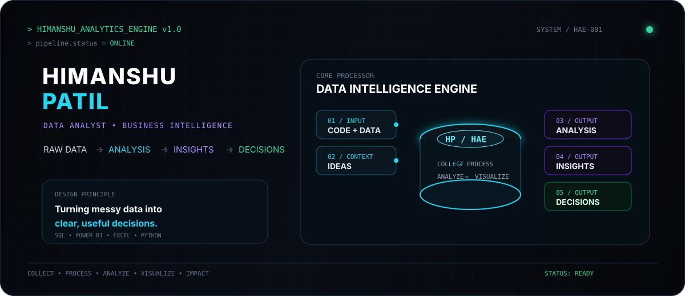

<div align="center">



### `DATA ANALYST` · `BUSINESS INTELLIGENCE`

**Turning raw data into meaningful insights and better decisions.**

[](https://linkedin.com/in/himanshu-patil20)
[](mailto:hmpatil1621@gmail.com)
[](https://github.com/hmpatil)

</div>

---

## ⚡ `SYSTEM PROFILE`

```text
ROLE        → Data Analyst / Business Intelligence
CORE        → SQL · Power BI · Excel · Python
DATA        → Pandas · NumPy · Matplotlib · Scikit-learn
DATABASE    → MySQL · SQLite
WORKFLOW    → Collect → Process → Analyze → Visualize → Impact
```

> I like taking messy datasets, finding the signal inside them, and turning that signal into dashboards, analysis, and decisions.

---

## 📊 `CORE STACK`

| Layer | Tools |
|---|---|
| **Analytics** | SQL · Power BI · Excel · Python |
| **Data** | Pandas · NumPy · Matplotlib · Scikit-learn |
| **Database** | MySQL · SQLite |
| **Supporting** | Git · GitHub · AWS · Hadoop |

---

## 🚀 `SELECTED WORK`

### 📈 Amazon Sales Analytics
**Power BI · Excel · DAX**

Sales analytics dashboard focused on KPIs, trends, product performance and business insights.

→ [**View repository**](https://github.com/hmpatil/Amazon-Sales-Analytics-Dashboard)

### 🧠 Mental Health Detection
**Python · NLP · Machine Learning**

An NLP/ML project exploring text-based mental-health signal detection and classification.

### 💊 Pharmacy Management System
**Web · SQL · Database**

A database-driven management system for medicines, inventory and sales workflows.

### 🛡️ Fraud Detection
**Python · Machine Learning · Pandas**

A machine-learning project focused on identifying suspicious transaction patterns.

---

## 📡 `GITHUB INTELLIGENCE`

<div align="center">


</div>

<div align="center">


</div>

---

## 🧭 `CURRENTLY BUILDING`

```text
[01] Advanced SQL
[02] Python for Data Analytics
[03] Business Intelligence
[04] Data Engineering foundations
[05] Real-world analytics projects
```

---

## 🤝 `LET'S CONNECT`

I'm interested in collaborating on **Data Analytics, Business Intelligence, SQL, dashboards, and data-driven projects**.

<div align="center">

**DATA → ANALYSIS → INSIGHT → IMPACT**

</div>

---

<div align="center">

`HIMANSHU ANALYTICS ENGINE v1.0`

<sub>Built with curiosity, data, and way too many late-night ideas.</sub>

</div>
